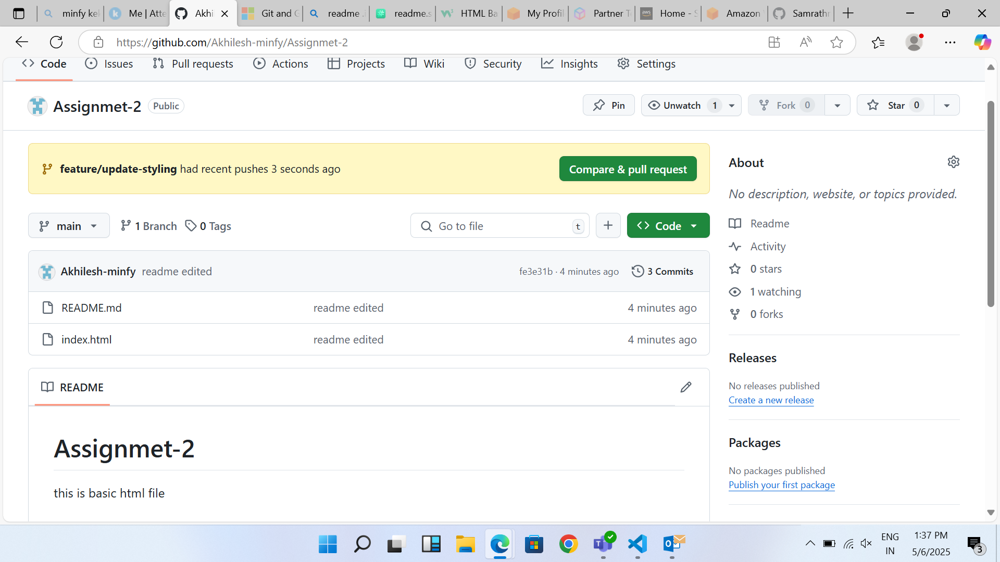
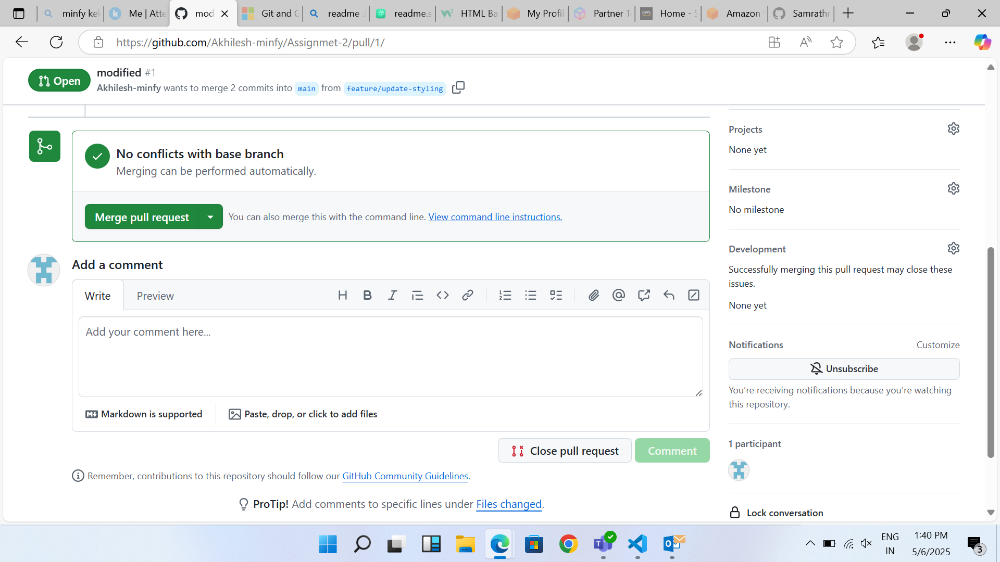
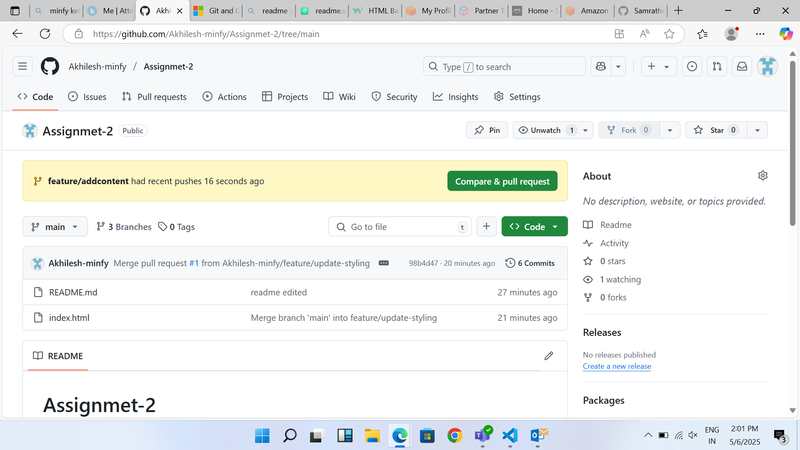
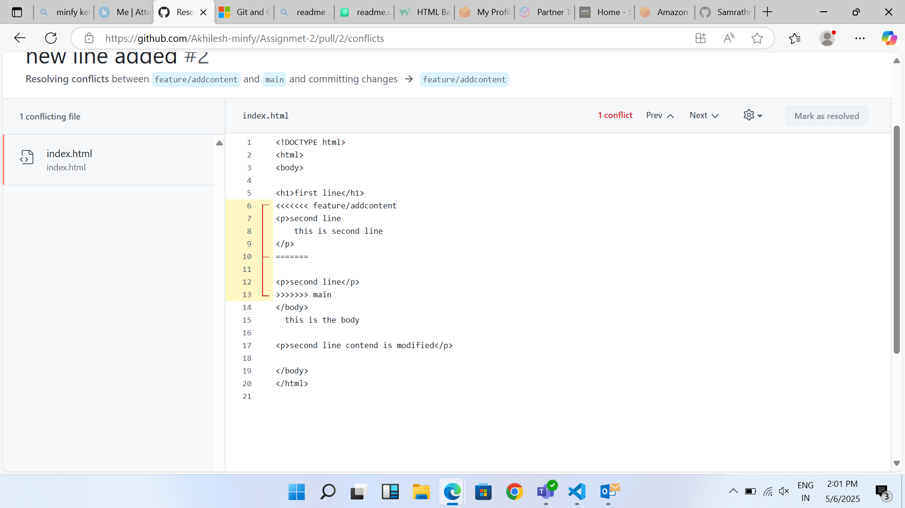

# Assignmet-2
this is basic html file
# GitHub Flow & Merge Conflict Practice

This project demonstrates the use of GitHub Flow, feature branching, and resolving merge conflicts using a basic HTML/CSS web page.

## Tasks Completed

1. **Initialized a Git repository**  
   Created a new GitHub repository and cloned it locally.

2. **Developed a basic HTML/CSS web page**  
   Built a simple web page using `index.html` and a CSS file.

3. **Created feature branches**  
   - `feature/update-styling`: Updated the visual styling using CSS.
   - `feature/add-content`: Added new HTML content to the page.

4. **Made conflicting changes**  
   Edited the **same line** in `index.html` on both branches to intentionally create a merge conflict.

5. **Opened and managed pull requests**  
   - Created pull requests for both feature branches.
   - Merged one PR into the `main` branch.

6. **Resolved a merge conflict**  
   - Encountered a merge conflict in `index.html` while merging the second PR.
   - Reviewed the conflict, manually resolved it by choosing/combining changes.
   - Completed the merge successfully.

## Outcome

- Learned how to manage branches and pull requests using GitHub Flow.
- Practiced resolving a real merge conflict on the **same line** of code.
- Improved understanding of collaboration and version control.

## merging first branch
- first branch merge

## conflict resolve

